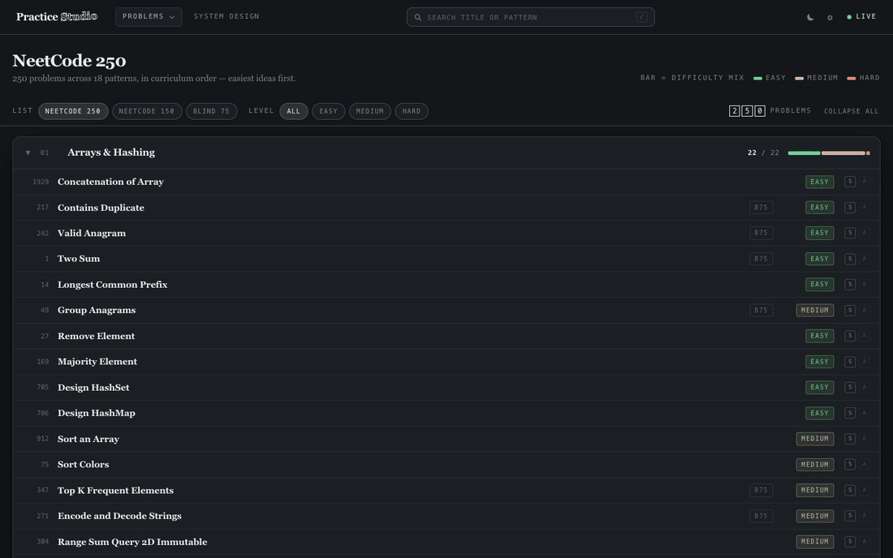
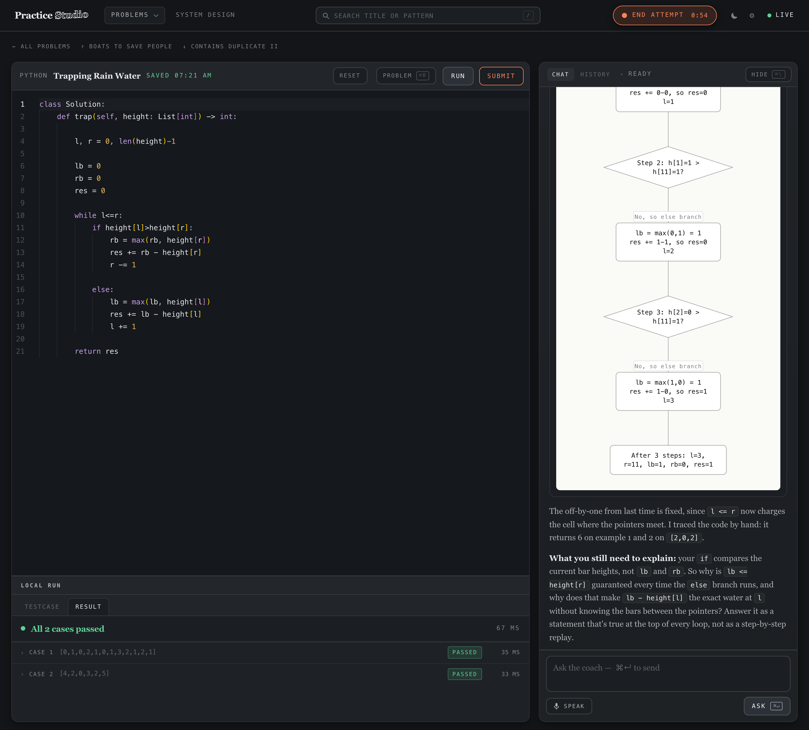
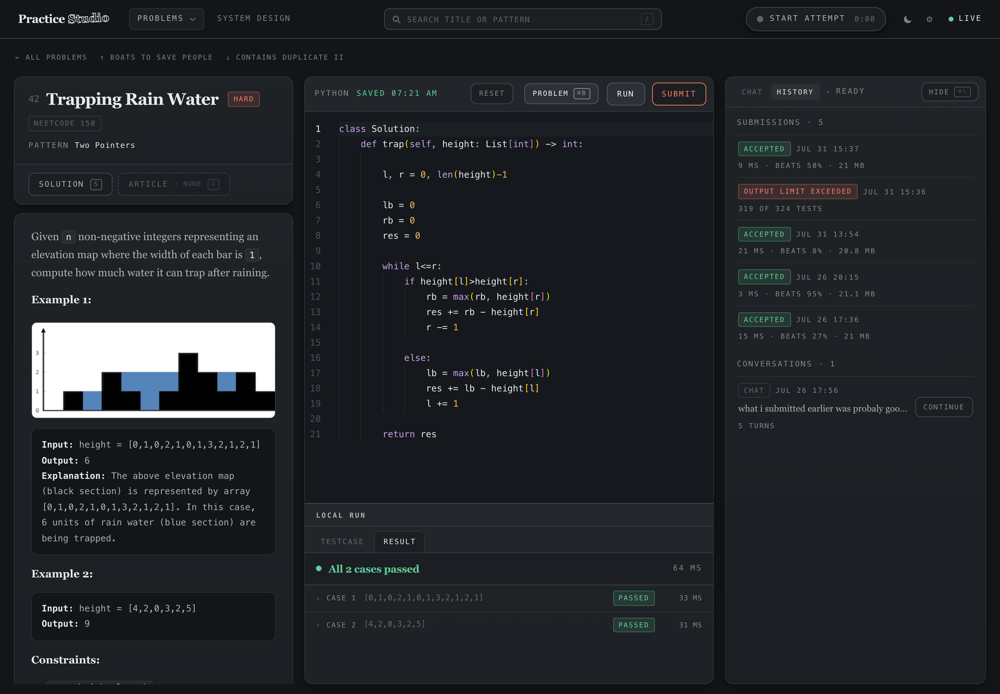
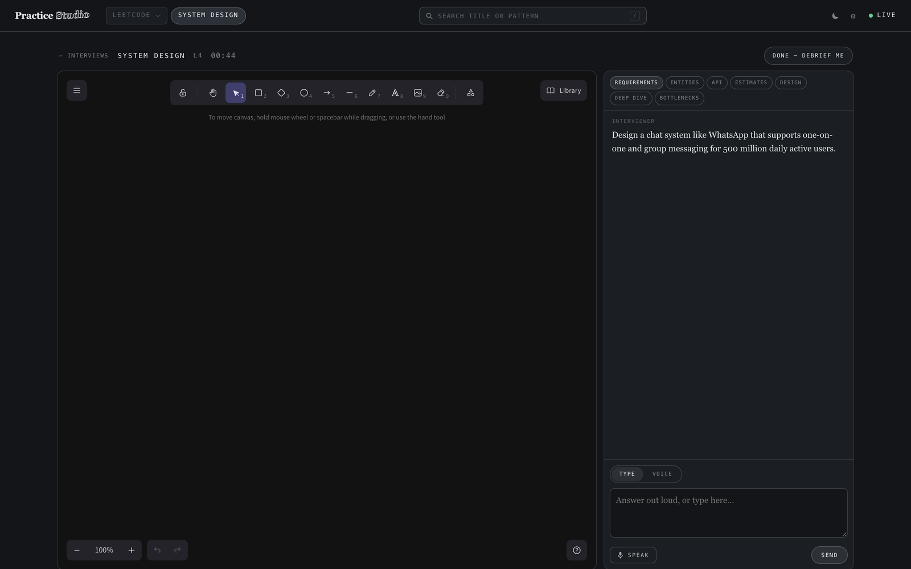
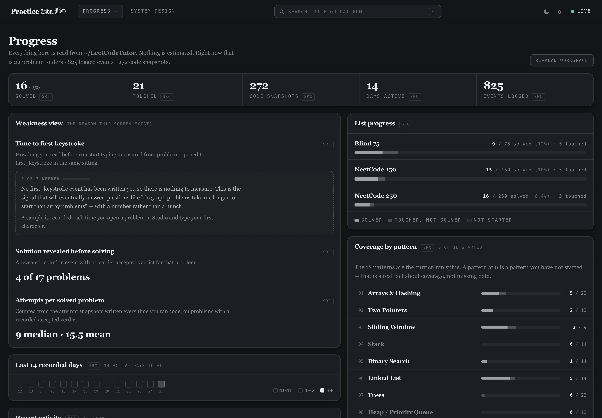
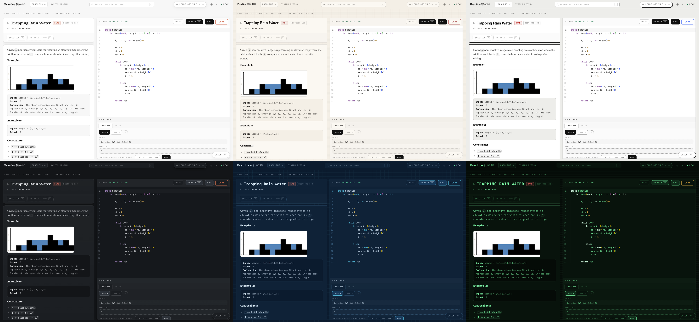
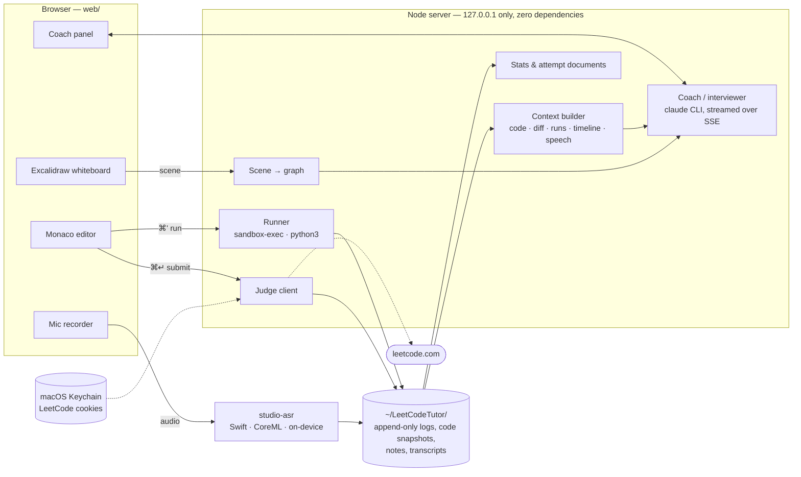

# Practice Studio

**A local-first interview practice studio with an AI coach that watches *how* you solve, not just whether you passed.**

You solve LeetCode problems in your own editor, against your own sandboxed runner, with
your voice optionally narrating your reasoning. A Claude-powered coach sees all of it — every
code version, every run, how long you took to start, what you said out loud — and coaches
the way a good interviewer would. It also runs full spoken system-design mock interviews
on a live whiteboard.

It all runs on your machine. No server, no account, and it keeps working on a plane.



---

## Why this exists

Grinding LeetCode tells you one thing: pass or fail. Interviews grade something else —
whether you can reason out loud, start without flailing, state complexity, and defend why
your approach is correct. None of that shows up in a green checkmark.

The obvious way to add an AI tutor is to point it at the LeetCode tab: screenshot the page,
scrape the verdict, guess what you typed. That is reverse-engineering a surface you do not
control, and every failure mode ends in silently wrong data.

So Studio **owns the loop**. The editor is ours, the runner is ours, the timeline is ours.
The coach gets the exact code, the exact timings, and every intermediate version — not a
photograph of them.

## What it does

### A coach that sees the whole session



Every coach turn is assembled from the live editor buffer, a diff since your last run,
per-case run results (with tracebacks rewritten to point at *your* lines), elapsed time,
time-to-first-keystroke, and a merged timeline of what you **did** and what you **said**.

It keeps notes per problem and a running picture of your habits across days, so feedback
compounds. From real coach notes:

> *"Instrumented instead of guessing … verifying one pass at a time — the exact habit
> missing on 07-25."*
>
> *"Never mentioned the O(1)-space two-pointer solution — on the Two Pointers track. This
> is the follow-up an interviewer asks immediately."*

The coach can also draw — recursion trees, pointer motion, DP tables — as Mermaid or SVG,
rendered inline after sanitisation.

### Think out loud, get graded like an interview

Press **Start attempt** (`⌥R`) and talk while you solve. Speech is transcribed **on-device**
(Parakeet TDT 0.6B via CoreML, ~489× realtime) and stitched into the timeline next to
your edits and runs. Press **End attempt** and the coach delivers an interviewer's verdict
unprompted: would this have passed a real screen, and the two things that would most
change your next attempt.

Every attempt is also written out as a readable document — minute by minute, what you said
beside what you typed beside what ran — regenerable from the raw logs at any time.

### A real local judge, offline



`⌘'` runs your code against the example cases in a fresh temp directory under macOS
`sandbox-exec` with the network denied, a wall-clock timeout, an output cap, and a
process-group kill so a runaway child cannot outlive the run. Comparison is semantic
(float tolerance, order-insensitive where the problem allows it). All 250 NeetCode problems
have a runnable recipe — linked lists, trees and in-place problems included.

When you are ready, `⌘↵` submits to LeetCode's real judge and shows its verdict verbatim.
A local pass and an accepted submission are never conflated.

### Spoken system-design mock interviews



A 45-minute interview across seven phases — requirements, entities, API, estimates,
design, deep dive, bottlenecks — with a curveball partway through and Socratic follow-ups
that make you find your own gaps.

- **The interviewer reads your diagram, not a picture of it.** The Excalidraw scene is
  converted into a component-and-connection graph after every edit, and the interviewer
  reasons about the difference between what you drew and what you claimed.
- **Voice mode.** The interviewer speaks; you answer out loud; going quiet ends your turn.
  Turn-taking tells a mid-sentence breath from a finished answer.
- **It never speaks for you.** A streaming guard cuts the reply mid-token the moment it
  could become "Candidate:" or a stage direction — before it is shown or spoken.

### Progress that never makes up a number



Every metric is computed from files on disk and carries a minimum-sample threshold.
Below it, the dashboard says *"need N more"* instead of showing a number it cannot back.

### Six themes



Paper, Editorial, Ink, Slate, Blueprint and Phosphor — each with a matching, hand-built
editor theme. Practice is repetitive; the room you practise in doesn't have to be.

## How it works



Everything the app knows lives in `~/LeetCodeTutor/` as plain files: append-only session
logs, every code version you ran, transcripts with word timings, coach notes. Raw logs are
the record; everything rendered from them is disposable and regenerable.
[`docs/ARCHITECTURE.md`](docs/ARCHITECTURE.md) has the full design.

## Engineering decisions worth a look

- **Zero runtime dependencies.** `package.json` has no `dependencies`. HTTP, SSE and
  process management are Node built-ins; Monaco and Excalidraw are vendored static assets.
  A machine that holds a session cookie is a bad place for a supply chain.
- **The coach is least-privilege, enforced by the CLI.** It runs with
  `--permission-mode manual`, can read only the workspace, and is denied writes to your
  solutions, session logs and code history — deny rules win over allow rules. Bash, web
  fetch and search are off. It cannot overwrite your work or the record of what happened.
- **Prompt-injection fencing.** Untrusted content — LeetCode HTML, articles, your own code —
  is wrapped in a fence whose marker is a fresh random token every turn, so fenced text
  cannot forge its own closing fence.
- **Streaming filters that cut mid-token.** The impersonation guard and the phase-tag
  stripper hold back any fragment that *could* become a forbidden pattern, because by the
  time a full line exists it has already been shown or spoken.
- **Credentials never touch disk.** LeetCode cookies live only in the macOS Keychain, and
  the credentials object refuses to serialise itself — `JSON.stringify`, `console.log` and
  string interpolation all print a redacted placeholder.
- **Loopback only, origin-checked.** The server executes code, so it binds `127.0.0.1` and
  checks `Origin`/`Host` on every request to blunt DNS rebinding.
- **Crash-safe logs.** Every reader tolerates a torn last line from a killed process —
  skipped and counted, never fatal.
- **Layout tests that look.** `scripts/check-*.mjs` drive headless Chrome over raw CDP and
  measure real `getBoundingClientRect()` boxes, catching overlap bugs no unit test can see.
- **Claims are labelled.** Design docs mark each technical claim `[VERIFIED <date>]` or
  `[UNVERIFIED]`, with the evidence.

## Getting started

**Requirements:** macOS, Node 22+, Python 3. Optional: the
[Claude Code CLI](https://docs.anthropic.com/en/docs/claude-code) for the coach and the
system-design interviewer; Swift 6 for voice.

```bash
git clone https://github.com/dhirajcdry/practice-studio.git
cd practice-studio

# Reference solutions and articles (MIT, from neetcode-gh/leetcode) — optional
git clone --depth 1 https://github.com/neetcode-gh/leetcode.git vendor/neetcode-solutions

npm start          # → http://127.0.0.1:4173
```

What needs what:

| Feature | Needs |
| --- | --- |
| Browse, read, write code, run locally | Nothing beyond the above — works offline once a problem is cached |
| AI coach, system-design interviewer | `claude` on your `PATH`, signed in. Without it the rest of the app works and the panel says why |
| Voice (narration, dictation, voice interviews) | `swift build -c release --package-path asr` |
| Submit to LeetCode | Three cookies in the Keychain (see below) |

To submit, store your LeetCode cookies in the Keychain under account `studio`:

```bash
security add-generic-password -a studio -s studio-leetcode-session     -w '<LEETCODE_SESSION>'
security add-generic-password -a studio -s studio-leetcode-csrf        -w '<csrftoken>'
security add-generic-password -a studio -s studio-leetcode-cfclearance -w '<cf_clearance>'
```

`cf_clearance` is bound to the browser that minted it; set `STUDIO_LEETCODE_UA` to that
browser's user agent if submissions are challenged.

### Configuration

| Variable | Default | Purpose |
| --- | --- | --- |
| `STUDIO_HOME` | `~/LeetCodeTutor` | The workspace: solutions, logs, notes, transcripts |
| `STUDIO_PORT` | `4173` | Server port (always loopback) |
| `STUDIO_COACH_BINARY` | `claude` | Path to the Claude Code CLI |
| `STUDIO_PYTHON` | `python3` | Python used by the local runner |
| `STUDIO_NO_SANDBOX` | unset | `1` disables `sandbox-exec` |
| `STUDIO_LEETCODE_UA` | pinned | User agent for submissions |
| `STUDIO_MIRROR_DIR` | unset | Folder for a live daily Markdown summary — point it at iCloud Drive to read your day on your phone |

### Keyboard

| Keys | Action |
| --- | --- |
| `/` · `j` `k` · `Enter` | Search · move · open |
| `⌘'` · `⌘↵` · `⌘S` | Run locally · submit · save |
| `⌘B` · `⌘J` · `⌘\` | Toggle problem · results · coach |
| `⌥R` | Start / end an attempt |
| `s` · `a` | Reveal solution · article (logged, so the dashboard can tell you your reveal rate) |

## Working offline

Everything except two things is on disk already: the curriculum, the reference solutions,
the articles, Monaco, and the runner. The two that are not are **problem content** and
**the judge**.

The judge cannot be helped — submitting is a request to LeetCode by definition. Problem
content can: statements, starting stubs and example cases are cached permanently in
`~/LeetCodeTutor/cache/leetcode/` the first time you open a problem. A problem you have
*never opened* is the one that fails on a plane, so:

```bash
npm run warm:check     # what would work right now with the wifi off — never touches the network
npm run warm           # fetch the rest, one every 1.5s, resumable
```

`warm` is deliberate and human-paced: sequential, and it stops the moment LeetCode signals
a challenge rather than carrying on into a block. Ctrl-C is safe; each problem is written
as it arrives.

## Project layout

| Path | What it is |
| --- | --- |
| `server/` | Node server. One directory per feature (`coach/`, `runner/`, `judge/`, `design/`, `asr/`, `stats/`, `attempts/`), each exporting a plain route table |
| `web/` | The UI — plain ES modules, no build step. `web/vendor/` holds Monaco and Excalidraw |
| `asr/` | `studio-asr`, the on-device speech-to-text CLI (Swift, FluidAudio) |
| `scripts/` | Generators (`catalog`, `solutions`, `warm`, `attempts`) and headless-Chrome layout checks |
| `data/` | Generated catalog and solutions index — regenerate with their scripts, never hand-edit |
| `docs/` | Architecture, API contracts, and the verified LeetCode protocol notes |

```bash
npm test           # 440+ unit and integration tests, node:test
npm run check      # headless-Chrome layout checks against a running server
```

Working on this with an AI coding agent? Read [`AGENTS.md`](AGENTS.md) first — the layout,
the constraints that don't bend, and the conventions that aren't obvious from the code.

## Credits

- Curriculum and list membership (Blind 75, NeetCode 150/250) from [neetcode.io](https://neetcode.io);
  reference solutions from [neetcode-gh/leetcode](https://github.com/neetcode-gh/leetcode) (MIT).
- Problem content and the judge are LeetCode's, fetched with your own session and cached
  only on your machine — none of it is in this repository.
- [Monaco Editor](https://github.com/microsoft/monaco-editor),
  [Excalidraw](https://github.com/excalidraw/excalidraw),
  [FluidAudio](https://github.com/FluidInference/FluidAudio).

## License

[MIT](LICENSE)
