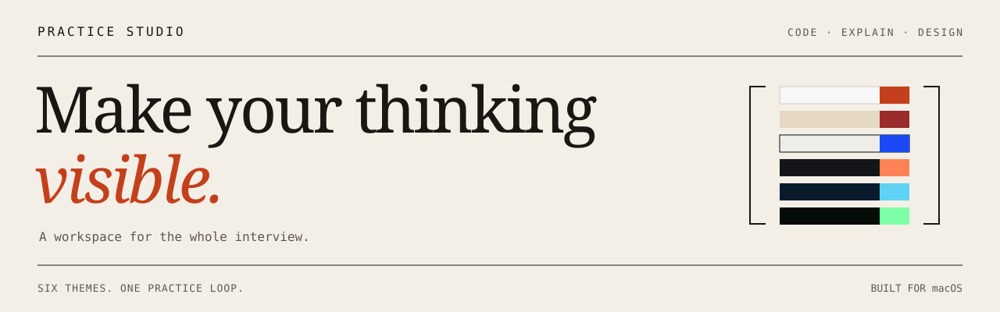
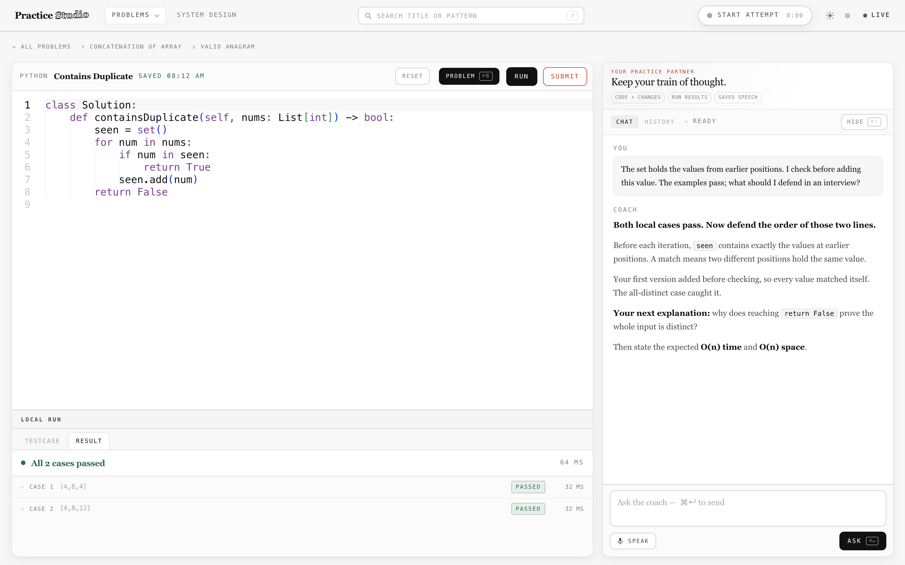
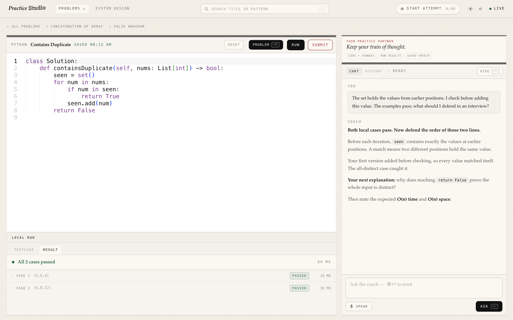
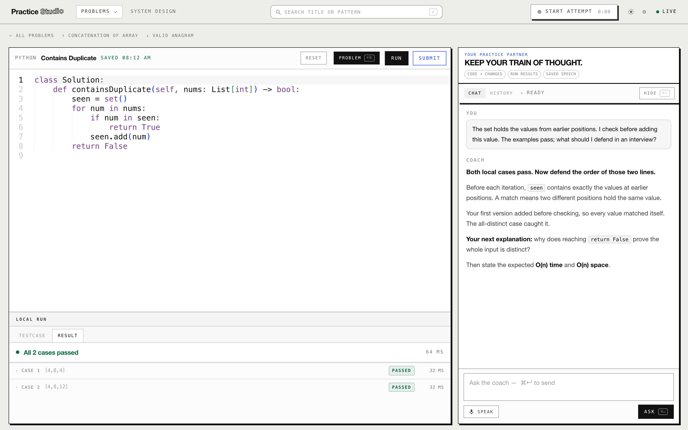
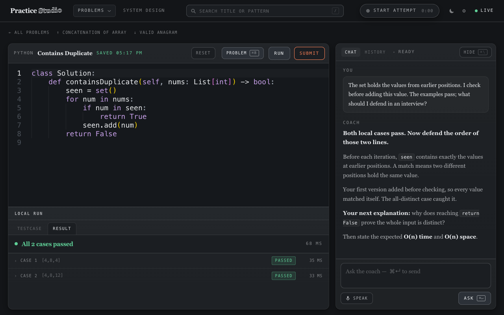
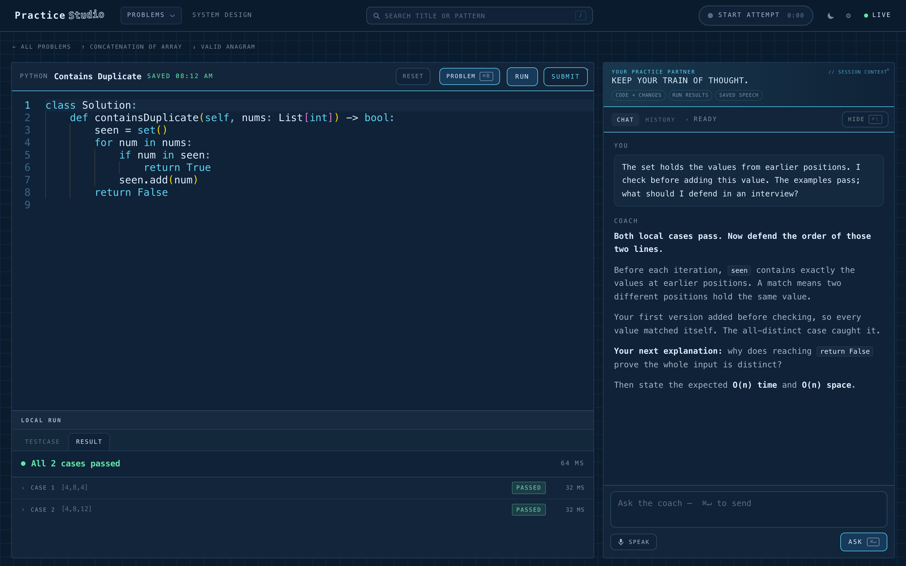
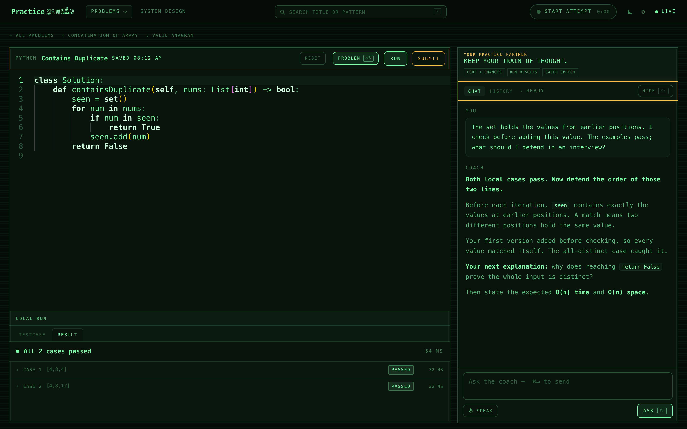
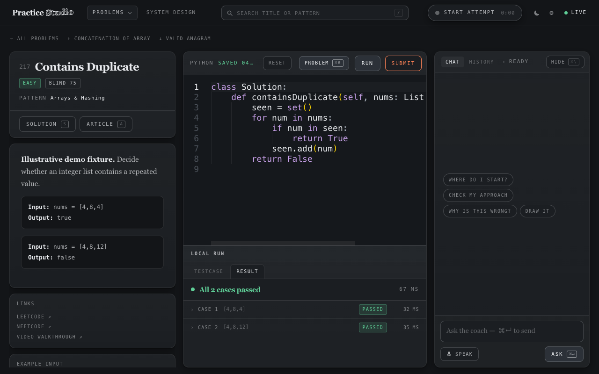
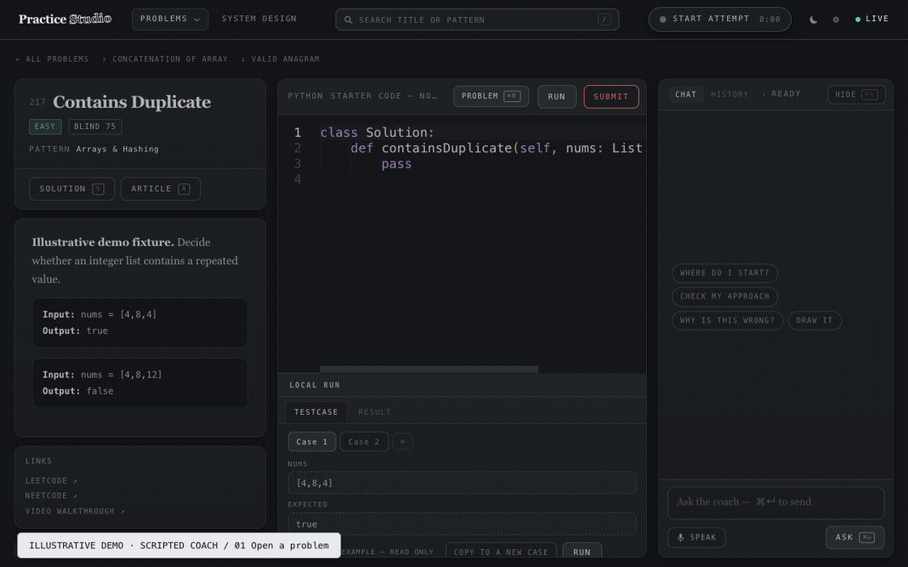

# Practice Studio

**A quieter way to practise coding and system-design interviews.**



Practice Studio keeps the work in one room: write Python, run real local cases, explain
your choices, and get a follow-up that can see the attempt. It is a macOS app you run
on your own machine, with local session records, optional voice, and optional Claude
coaching.

[Quick start](#quick-start) · [First session](docs/FIRST-SESSION.md) · [Example session](docs/EXAMPLE-SESSION.md) · [Privacy & offline use](docs/PRIVACY.md)


*An illustrative session in the actual app. Code runs locally; the coaching in this
image is scripted for the demo. [See the full example and how the images are made.](docs/EXAMPLE-SESSION.md)*

## Six ways to make it yours

The interface has six distinct moods, from a warm paper desk to a glowing terminal.
Open the gear, then choose a theme under **Settings → Theme**. Your choice is stored
locally and applied before the first paint.

<table>
<tr>
<td><a href="docs/images/theme-paper.png"></a><br><strong>Paper</strong><br><sub>Warm off-white, serif display, quiet terracotta.</sub></td>
<td><a href="docs/images/theme-editorial.png"></a><br><strong>Editorial</strong><br><sub>Laid paper, Palatino, and a deep red accent.</sub></td>
</tr>
<tr>
<td><a href="docs/images/theme-ink.png"></a><br><strong>Ink</strong><br><sub>High contrast, hard rules, electric blue.</sub></td>
<td><a href="docs/images/theme-slate.png"></a><br><strong>Slate</strong><br><sub>Paper after dark, with softened charcoal edges.</sub></td>
</tr>
<tr>
<td><a href="docs/images/theme-blueprint.png"></a><br><strong>Blueprint</strong><br><sub>Cyan drafting marks on a deep navy grid.</sub></td>
<td><a href="docs/images/theme-phosphor.png"></a><br><strong>Phosphor</strong><br><sub>Green terminal light, amber signal, scanlines.</sub></td>
</tr>
</table>

## The practice loop

### Code until the evidence is useful

Browse the NeetCode 250 curriculum, write Python in Monaco, and run example or custom
cases in a fresh local runner. The result is part of the attempt, so the coach can ask
about the invariant you used, the case you missed, or the complexity you can defend.



### Explain the thinking, not just the answer

Narrate an attempt or ask a typed question. The coach can receive your buffer, code
changes, run results, elapsed time, and available transcripts. Voice mode uses the
on-device transcriber after its model is downloaded; spoken responses use the browser's
speech synthesis. [Read the voice setup and boundaries.](docs/SETUP.md#voice-input)

### Draw the design you would defend

Use the Excalidraw board for a full system-design mock interview. The interviewer can
probe requirements, estimates, and tradeoffs while the board graph becomes part of the
next answer.


<details>
<summary>Watch a short coding walkthrough</summary>



The walkthrough uses a temporary demo workspace and scripted coaching. No account,
Claude request, or LeetCode submission is used to produce it.

</details>

## Quick start

**Requirements:** macOS, Node.js 22+, and Python 3. The editor and local runner work
without Claude Code. Voice additionally requires macOS 14+, Swift 6, and the downloaded
speech model.

```sh
git clone https://github.com/dhirajcdry/practice-studio.git
cd practice-studio
npm start
```

Open **http://127.0.0.1:4173**. There is no npm install or frontend build step. Search
for a problem, open it while online to cache its statement and starter code, then write
your solution and press **Run**. Local results cover the cases shown; they are separate
from an accepted LeetCode submission.

| Optional piece | Setup |
| --- | --- |
| AI coach and system-design interviewer | Install and sign in to the Claude Code CLI; `claude` must be on your `PATH`. Coaching uses its configured online service. |
| Voice input | Run `swift build -c release --package-path asr`. The first transcription downloads the model; allow microphone access in your browser. |
| Reference solutions and articles | `git clone --depth 1 https://github.com/neetcode-gh/leetcode.git vendor/neetcode-solutions` |
| LeetCode submissions | Store session cookies in macOS Keychain. [Submission setup](docs/SETUP.md#leetcode-submissions). |

[First session](docs/FIRST-SESSION.md) walks through the screens and expected results.
[Setup & troubleshooting](docs/SETUP.md) covers optional features, environment
variables, and keyboard shortcuts.

## Local storage, connected coaching

The browser talks to a Node server bound to `127.0.0.1`. Solutions, logs, transcripts,
and notes are stored in `~/LeetCodeTutor/` (configurable with `STUDIO_HOME`). Monaco and
Excalidraw are bundled in the repository.

Cached problems and the Python runner work offline. Claude coaching needs connectivity
and sends session context to its configured service. Fetching new problem statements and
submitting solutions contact LeetCode. Speech recognition runs on-device after its model
is downloaded. [Privacy & offline use](docs/PRIVACY.md) explains the boundary in full.

## Project notes

[Architecture](docs/ARCHITECTURE.md) explains the processes, storage, and boundaries.
[Engineering decisions](docs/ENGINEERING.md) links the implementation and tests behind
them. [Current limitations](docs/LIMITATIONS.md) · [Roadmap](docs/ROADMAP.md) ·
[Contributing](CONTRIBUTING.md).

## Development

Clone the optional reference repository above before running the full test suite:

```sh
npm test           # Node unit and integration tests; fake coach and judge
npm run check      # Chrome checks; see CONTRIBUTING.md for scratch-workspace setup
```

| Directory | Purpose |
| --- | --- |
| `server/` | Routes, Python runner, coach, judge client, attempt records, and stats |
| `web/` | Browser UI and committed Monaco/Excalidraw assets |
| `asr/` | Optional Swift/CoreML speech recognizer |
| `data/` | Generated curriculum and reference index |
| `scripts/` | Generators, browser checks, and reproducible demo capture |
| `docs/` | User guides, architecture, API contracts, and protocol research |

Working with a coding agent? Start with [AGENTS.md](AGENTS.md).

## Credits & license

Curriculum and list membership come from [NeetCode](https://neetcode.io); optional
reference solutions and articles from [neetcode-gh/leetcode](https://github.com/neetcode-gh/leetcode)
(MIT). LeetCode problem statements are fetched into your local cache and aren't
distributed with this repository. Demo statements are original illustrative fixtures.

Built with [Monaco Editor](https://github.com/microsoft/monaco-editor),
[Excalidraw](https://github.com/excalidraw/excalidraw), and
[FluidAudio](https://github.com/FluidInference/FluidAudio).

[MIT license](LICENSE).
