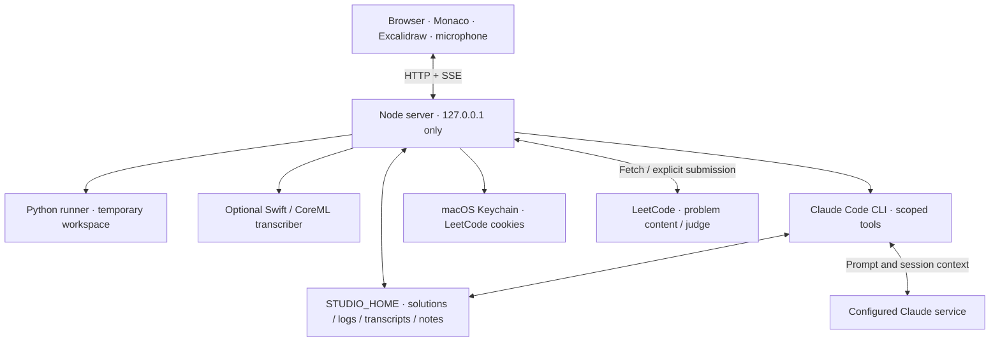

# Practice Studio architecture

This describes the implementation in the repository. The original July 2026 design and
its dated measurements are preserved in [the design archive](archive/ARCHITECTURE-2026-07-25.md);
those measurements aren't current product guarantees.

## Processes and network boundary

The app has a **local Node server**, not a hosted backend. `server/paths.mjs` fixes the
host to `127.0.0.1`; the router checks request `Host`/`Origin`. The browser receives
static files and calls JSON routes. Coaching and interviewing stream events over SSE.

The editor, catalog, and local runner don't wait for a coach turn or judge verdict.
Opening an uncached problem does require a content fetch; cached statements are used
without a request. New AI turns require the CLI's configured online service. Optional
speech-model downloads and reference clones are setup-time network operations. See
[privacy & offline use](PRIVACY.md) for the complete boundary.

## Dependencies

`package.json` has no npm runtime dependencies. HTTP, filesystem, subprocess management,
and streaming use Node built-ins. The frontend is plain browser ES modules, served without
a build step. Monaco and Excalidraw are committed under `web/vendor/`, including fonts and
bundled library code. Excalidraw is loaded when the design view opens.

Python 3 is an external runtime. Claude Code is an optional external executable, with its
own authentication and service. The optional Swift target pins FluidAudio in
`asr/Package.swift`; its CoreML model is downloaded and cached separately. "No npm runtime
dependencies" doesn't mean the entire system is dependency-free.

## Storage

`STUDIO_HOME` defaults to `~/LeetCodeTutor`. Important records are ordinary files:

| Path under the workspace | Role |
| --- | --- |
| `problems/<slug>/solution.py` | Current working solution; atomically saved by the editor route |
| `problems/<slug>/attempts/*.py` | Code snapshots from runs |
| `problems/<slug>/sessions/*.jsonl` | Append-only activity events |
| `problems/<slug>/chats.jsonl` | Coach conversation record |
| `problems/<slug>/transcripts/` | Saved coding transcripts and timing metadata |
| `problems/<slug>/NOTES.md`, `debriefs/` | Coach memory and feedback |
| `problems/<slug>/attempts/<id>/attempt.md` | Derived readable attempt document |
| `cache/leetcode/<slug>.json` | Cached problem content, metadata, and starter code |
| `design/<id>/interview.json` | Mutable interview state: phase, timing, session identity |
| `design/<id>/turns.jsonl`, `scenes/*.json` | Recorded answers/questions and board snapshots |
| `design/<id>/interview.md` | Derived readable interview document |
| `design/<id>/NOTES.md`, `DESIGN.md` | Design-interview coaching memory |

Raw activity/turn logs and code/scene snapshots preserve the evidence. Readers tolerate
an invalid final JSONL line from an interrupted write. Rendered documents are rebuilt
from the records, rather than used as new evidence. The browser keeps editor recovery
drafts and preferences in local storage; the CLI also has its own conversation storage.

The canonical problem key is the LeetCode slug. The generated catalog stores a separate
NeetCode slug for upstream articles and list membership. Reference lookup checks both
problem number and compatible slug tokens, because upstream filenames can disagree.

## Coding loop

1. The content cache supplies the Python stub, function/class metadata, example inputs,
   and statement. A missing statement is fetched lazily and then cached.
2. The editor saves the buffer through the workspace route and retains a browser draft.
3. A local run builds cases, snapshots the code, and creates a temporary driver workspace.
4. Python executes the submitted buffer. Results include per-case actual/expected values,
   stdout, timing, and mapped tracebacks.
5. The results panel distinguishes passed, failed, unknown, unsupported, and execution errors.

The runner handles function and supported class-style shapes, trees, lists, linked lists,
and in-place output adapters. Comparison supports float tolerance and selected
order-insensitive cases. Coverage of a recipe or adapter isn't proof of correctness
against hidden tests.

`server/runner/execute.mjs` starts a detached process group, enforces a wall-clock timeout
and output cap, and kills the group on cancellation/timeouts. The Python driver applies
best-effort resource limits and blocks common socket entry points. On macOS,
`sandbox-exec` supplies the OS-level network denial when available and enabled. This
is a practice runner for your own code; the sandbox isn't a general filesystem isolation
boundary. Vendored reference solutions are never run as the expected-answer oracle.

## Coaching

`server/coach/context.mjs` assembles a turn from the current editor buffer, available code
diff, local run evidence, timing, recent activity, and speech transcripts. User and
third-party material is labelled untrusted and fenced with a fresh random marker.
That framing helps the model interpret data; permission scoping is a separate boundary.

`server/coach/claude-cli.mjs` spawns the CLI with manual permissions, restricted tools,
strict MCP configuration, workspace path rules, and explicit denies for working code and
server-owned evidence. Design notes, coding notes/debriefs, journal, profile, and skill
memory are the writable areas. The CLI can read workspace files, so moving private files
into the workspace makes them available to coaching.

The turn registry keeps a streaming turn separate from the viewer's HTTP connection.
Reloading a tab can reattach rather than launch a duplicate turn. Failed and interrupted
turns are recorded as such. Ending an attempt requests a review of the available evidence;
its judgment is advisory.

## System-design interviews

`server/design/interview.mjs` tracks phase, elapsed time, follow-up depth, and curveball
state. New turns resume the CLI thread when possible; if a saved thread is absent, the
server can rehydrate a fresh prompt from the recorded interview.

The browser saves scene changes separately from answers. Posting a scene doesn't wake
the model. On the candidate's next answer, `sceneToGraph()` extracts labelled components
and connections, and the turn context includes a graph diff. Freehand nuance and unlabeled
shapes may be lost in this representation.

The narration filter and phase-tag stripper hold back incomplete patterns while tokens
arrive. This lets them cut a reply that begins impersonating the candidate before the
full forbidden label reaches the viewer or speech output. The recorded turn indicates
when the guard interrupted a response.

Typed and voice answers are separate modes. The optional Swift transcriber handles audio
locally; browser `speechSynthesis` reads interviewer replies. Leaving the view pauses its
clock. The library supports resuming unfinished interviews and reading completed records.

## Real judge and credentials

The judge routes send one submission per explicit user action. Polling reads the result
of that submission; it doesn't create new submissions. Responses are normalized while
preserving the distinction between a local result, submission state, and actual verdict.

Credentials are fetched from macOS Keychain at use time. `LeetCodeCredentials` redacts
ordinary serialization/inspection, and errors scrub known secret values. Keychain is
persistent credential storage, not a guarantee that credentials never exist on disk.
Session/CSRF cookies are required; `cf_clearance` is used when available for challenges.

## Validation and further reading

`npm test` runs Node unit/integration tests with local fixtures and fake CLI/judge responses.
The CI workflow runs that suite on macOS. Browser checks measure real Chrome layout and
exercise rendering, shortcuts, streaming, and the Excalidraw bundle. They have additional
setup requirements described in [contributing](../CONTRIBUTING.md).

- [Engineering decisions and test locations](ENGINEERING.md)
- [API contract](API-CONTRACT.md) and [coding/coach additions](API-CONTRACT-P2.md)
- [Dated LeetCode protocol research](LEETCODE-API.md)
- [Privacy & offline use](PRIVACY.md)
