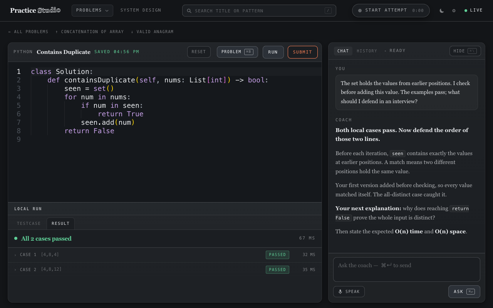
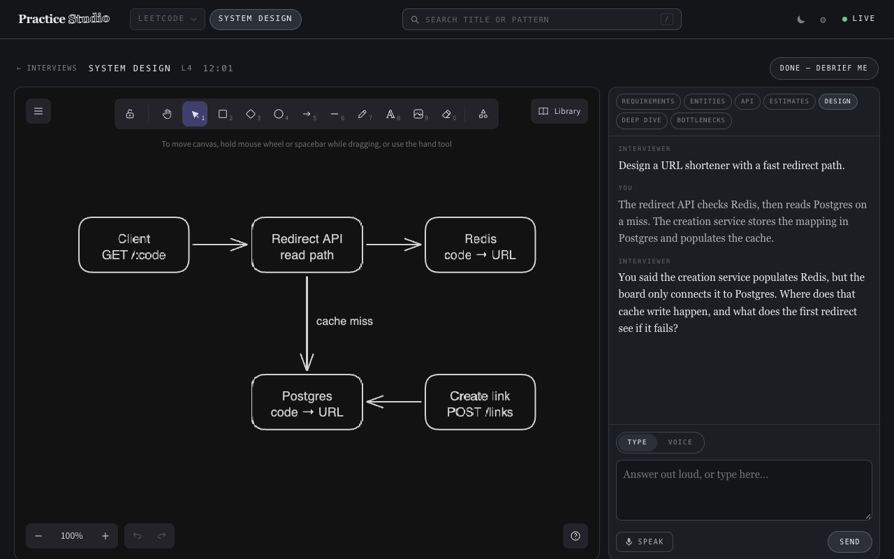

# Example session: the tests pass; explain why

**This is an illustrative session, not a transcript of a real learner or an AI evaluation.**
Its statement, code, candidate explanation, and coach replies are checked-in demo
fixtures. The screenshots show the actual app. The capture script executes the code
through the real Python runner and checks the outcomes; the coach is a scripted local
executable. No private practice record, model request, or LeetCode submission is used.

## The task

Decide whether an integer list contains a repeated value. The original demo fixture uses:

| Input | Expected output |
| --- | --- |
| `[4, 8, 4]` | `True` |
| `[4, 8, 12]` | `False` |

The first input has a non-adjacent repeat. The second checks that a value doesn't count
as a duplicate of itself.

## First approach

```python
class Solution:
    def containsDuplicate(self, nums: List[int]) -> bool:
        seen = set()
        for num in nums:
            seen.add(num)
            if num in seen:
                return True
        return False
```

The local run passes the repeated-value case and fails the all-distinct case: it returns
`True` for both. Adding the current value before membership testing makes it match itself
on the first iteration. A passing case alone would have hidden the problem.

## Correct the order and run again

```python
class Solution:
    def containsDuplicate(self, nums: List[int]) -> bool:
        seen = set()
        for num in nums:
            if num in seen:
                return True
            seen.add(num)
        return False
```

Both demo cases pass. That establishes those two outcomes; it doesn't establish acceptance
by LeetCode's hidden tests. The next useful work is to explain why the order is correct.

## Explain, then ask for feedback

The candidate's scripted explanation is:

> The set holds the values from earlier positions. I check before adding this value.
> The examples pass; what should I defend in an interview?

The scripted coach connects the answer to the actual edit and earlier failure:

> **Both local cases pass. Now defend the order of those two lines.**
>
> Before each iteration, `seen` contains exactly the values at earlier positions.
> A match means two different positions hold the same value.
>
> Your first version added before checking, so every value matched itself. The
> all-distinct case caught it.
>
> **Your next explanation:** why does reaching `return False` prove the whole
> input is distinct?
>
> Then state the expected **O(n) time** and **O(n) space**.



## What to practise next

Explain the invariant in three steps:

1. Before the first iteration, `seen` is empty, so it contains precisely the earlier values.
2. If the current value is already present, an earlier position has the same value.
   Otherwise adding it preserves the invariant for the next iteration.
3. If the loop finishes, every position was checked against all earlier values without
   a match; no pair of positions contains the same value.

Then state the cost: one pass, expected constant-time set operations, and a set that can
grow to the input size. Add cases such as `[5, 5]` and `[5, 9, 14, 5]`. These are proposed
next checks, not extra results claimed by the demo.

This is the kind of feedback Studio is built to support: the coach can connect the
current solution, an earlier code version, a run, and the explanation. Actual model
feedback varies and should be checked against the evidence.

## System design: the board is evidence

The second illustrative session asks for a URL shortener with a fast redirect path.
The board shows a client, redirect API, Redis, Postgres, and a creation service. The
creation service is connected to Postgres; its cache write isn't drawn.

The candidate says:

> The redirect API checks Redis, then reads Postgres on a miss. The creation service
> stores the mapping in Postgres and populates the cache.

The scripted interviewer asks:

> You said the creation service populates Redis, but the board only connects it to
> Postgres. Where does that cache write happen, and what does the first redirect see
> if it fails?



The drawing is deliberately incomplete. The useful follow-up concerns the disagreement
between the candidate's claim and the board, including behavior when a cache write fails.
In normal use, Studio supplies the extracted component/connection graph to Claude on the
next answer; it doesn't need a screenshot to identify those edges.

## Reproduce the demo

From the repo root on macOS with Node 22+, Python 3, and Google Chrome:

```sh
npm run demo
```

The command prints two local URLs and keeps a separate demo server open. It creates a
new temporary workspace, uses original cached content and scripted coaching, and removes
its data when stopped with Ctrl-C. Your regular practice workspace isn't read or changed.
Explore the seeded **Contains Duplicate** and saved design interview. This demo server
disables live content fetching, real submissions, and microphone transcription; clicking
those controls explains that they are unavailable in the demo.

To regenerate the checked-in screenshots and GIF, additionally install `ffmpeg`:

```sh
npm run demo:capture
```

The capture runs both code versions, verifies the expected failure and two-case pass,
drives the real composer, and opens the saved diagram in the real Excalidraw view. It
blocks external browser URLs and submission/transcription endpoints while capturing.
The demo server also disables connected integrations, and all content needed for the
selected routes is pre-seeded. Chrome is expected at
`/Applications/Google Chrome.app/Contents/MacOS/Google Chrome`; override with
`STUDIO_CHROME` if needed. `STUDIO_DEMO_PORT` and `STUDIO_DEMO_CDP_PORT` override the
demo server's port (4196) and optionally choose a Chrome debugging port; by default
Chrome gets a free port automatically.

Sources: [fixture](../scripts/demo/fixture.mjs), [scripted coach](../scripts/demo/coach.mjs),
and [capture script](../scripts/capture-demo.mjs).
